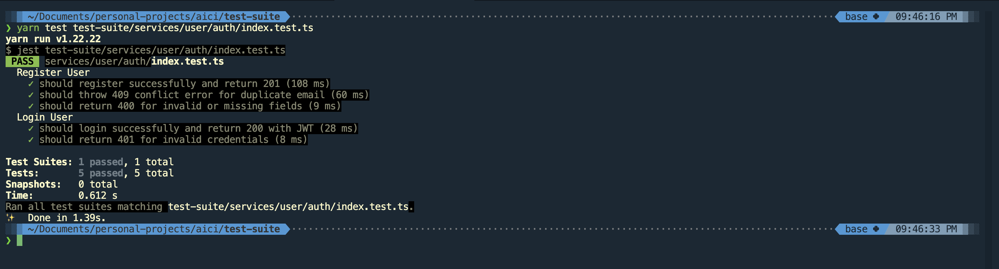
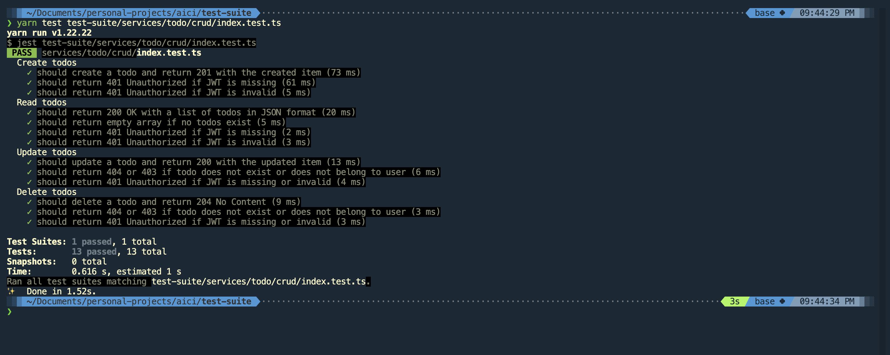

# Todo Application - Microservices Architecture

A full-stack todo application built with microservices architecture, featuring user authentication, todo management, and comprehensive testing.

## 💻 My Device Configuration

- **OS**: macOS Sequoia Version 15.5
- **Chip**: Apple M1

## 🏗️ Architecture Overview

This project follows a microservices architecture with the following components:

- **User Service** (Port 3000) - Handles user authentication and management
- **Todo Service** (Port 3001) - Manages todo CRUD operations
- **Frontend** (Port 4179) - React-based user interface
- **PostgreSQL** (Port 5432) - Primary database
- **Redis** (Port 6379) - Token storage and session management

## 🛠️ Technologies Used

### Backend Services

- **Framework**: Ultimate Express (Custom Express wrapper)
- **Database**: PostgreSQL with Prisma ORM
- **Authentication**: JWT tokens with Redis storage
- **Validation**: Joi with Celebrate middleware
- **Language**: TypeScript

### Frontend

- **Framework**: React 19.1.1
- **Build Tool**: Vite
- **Styling**: Tailwind CSS 4.1.11
- **HTTP Client**: Axios
- **Routing**: React Router DOM

### Testing

- **Framework**: Jest
- **Integration Testing**: Axios
- **Test Environment**: Separate test suite with API testing

### DevOps

- **Containerization**: Docker & Docker Compose
- **Development**: Hot reload for all services
- **Database**: Automated migrations for future development

## 📁 Project Structure

```
├── docker-compose.yaml        # Docker orchestration
├── README.md                  # This file
├── user-service/              # Authentication microservice
│   ├── src/
│   │   ├── controllers/       # Route handlers
│   │   ├── services/          # Business logic
│   │   ├── utils/             # Database and Redis utilities
│   ├── prisma/                # Database schema and migrations
│   └── package.json
├── todo-service/              # Todo management microservice
│   ├── src/
│   │   ├── controllers/       # Route handlers
│   │   ├── services/          # Business logic
│   │   ├── utils/             # Database and Redis utilities
│   ├── prisma/                # Database schema and migrations
│   └── package.json
├── frontend/                  # React application
│   ├── src/
│   │   ├── components/        # React components
│   │   ├── services/          # API integration
│   │   └── hooks/             # Custom React hooks
│   └── package.json
└── test-suite/               # Integration tests
    ├── services/
    │   ├── user/auth/        # User authentication tests
    │   └── todo/crud/        # Todo CRUD tests
    └── package.json
```

## 🚀 Quick Start

### Prerequisites

- Docker and Docker Compose
- Node.js 20+ (for local development)
- Yarn package manager

### 1. Clone and Start with Docker (Recommended)

```bash
# Clone the repository
git clone git@github.com:gulzerr/aici.git
cd aici

# Build all services with Docker Compose
docker compose build

# Start all services with Docker Compose
docker compose up -d

# Wait for all services to start (30-60 seconds)
# Frontend: http://localhost:4179
# User Service: http://localhost:3000
# Todo Service: http://localhost:3001
```

### 2. Run The Migration SQL File In Your Database

file: [migration.sql](./user-service/prisma/migration.sql)

For now the migration is manual. In future we will automate the process.

### 3. Local Development Setup

If you prefer to run services locally:

```bash
# Start only database and Redis with Docker
docker compose up postgres redis -d

# Install dependencies for all services
cd user-service && yarn install && cd ..
cd todo-service && yarn install && cd ..
cd frontend && yarn install && cd ..
cd test-suite && yarn install && cd ..
```

#### Run User Service (Terminal 1)

```bash
cd user-service
yarn dev  # Runs on http://localhost:3000
```

#### Run Todo Service (Terminal 2)

```bash
cd todo-service
yarn dev  # Runs on http://localhost:3001
```

#### Run Frontend (Terminal 3)

```bash
cd frontend
yarn dev  # Runs on http://localhost:4179
```

## 🧪 Testing

### Running Integration Tests

The project includes a comprehensive test suite that tests all user stories via API calls.

```bash
cd test-suite

# Install dependencies
yarn install

# Run all tests
yarn test

# Run specific test suites
yarn test services/user/auth/        # User authentication tests
yarn test services/todo/crud/        # Todo CRUD tests
```

### Test Coverage

The integration tests cover all the following user stories that was mentioned in the requirements file:

#### User Authentication

- ✅ User registration (201 Created, 409 Conflict, 400 Bad Request)
- ✅ User login (200 OK with JWT, 401 Unauthorized)
- ✅ User logout (200 OK, token invalidation)

#### Todo Management

- ✅ Create todo (201 Created, 401 Unauthorized)
- ✅ Read todos (200 OK, 401 Unauthorized, empty array for new users)
- ✅ Update todo (200 OK, 404 Not Found)
- ✅ Delete todo (204 No Content, 404 Not Found)
- ✅ Complete/Uncomplete todo status changes

## 🔧 API Documentation

### User Service Endpoints

#### POST /api/users/register

Register a new user account.

**Request:**

```json
{
  "first_name": "John",
  "last_name": "Doe",
  "email": "john.doe@example.com",
  "password": "securePassword123"
}
```

**Response (201):**

```json
{
  "isError": false,
  "body": {
    "message": "User created successfully"
  }
}
```

#### POST /api/users/login

Authenticate user and receive JWT token.

**Request:**

```json
{
  "email": "john.doe@example.com",
  "password": "securePassword123"
}
```

**Response (200):**

```json
{
  "isError": false,
  "token": "eyJhbGciOiJIUzI1NiIsInR5cCI6IkpXVCJ9..."
}
```

#### POST /api/users/logout

Logout user and invalidate JWT token.

**Headers:**

```
Authorization: Bearer <jwt-token>
```

**Response (200):**

```json
{
  "isError": false,
  "body": {
    "message": "Logged out successfully"
  }
}
```

### Todo Service Endpoints

All todo endpoints require JWT authentication via `Authorization: Bearer <token>` header.

#### POST /api/todos

Create a new todo item.

**Request:**

```json
{
  "content": "Complete the project documentation"
}
```

**Response (201):**

```json
{
  "isError": false,
  "body": {
    "message": "Todo created successfully",
    "data": {
      "data": {
        "id": 17,
        "uuid": "29e64d95-e2a8-417a-be0c-33eb3a292d5a",
        "content": "hello world, this is my last todo",
        "user_uuid": "bf97a4d4-0cd9-4f3f-a620-5f75807534cb",
        "is_completed": false,
        "is_deleted": false,
        "created_at": "2025-08-08T19:16:16.889Z",
        "updated_at": "2025-08-08T19:16:16.889Z"
      }
    }
  }
}
```

#### GET /api/todos

Retrieve all todos for authenticated user.

**Response (200):**

```json
{
  "isError": false,
  "body": {
    "data": [
      {
        "uuid": "todo-uuid-123",
        "content": "Complete the project documentation",
        "is_completed": false,
        "created_at": "2025-01-08T19:30:00.000Z"
      }
    ]
  }
}
```

#### PUT /api/todos/:id

Update a todo item.

**Request:**

```json
{
  "content": "Updated todo content"
}
```

**Response (200):**

```json
{
  "isError": false,
  "body": {
    "message": "Todo updated successfully",
    "data": {
      "id": 1,
      "uuid": "edcd187b-7b3e-4c41-92ca-ff415748b973",
      "content": "Updated todo content",
      "user_uuid": "bf97a4d4-0cd9-4f3f-a620-5f75807534cb",
      "is_completed": true,
      "is_deleted": true,
      "created_at": "2025-08-07T22:00:33.436Z",
      "updated_at": "2025-08-08T19:38:41.590Z"
    }
  }
}
```

#### PUT /api/markComplete/:id

Mark todo as completed.

**Response (200):**

```json
{
  "isError": false,
  "body": {
    "message": "Todo marked as complete"
  }
}
```

#### PUT /api/markUncomplete/:id

**Response (200):**

```json
{
  "isError": false,
  "body": {
    "message": "Todo marked as uncomplete"
  }
}
```

#### DELETE /api/todos/:id

Delete a todo item (soft delete).

**Response (204):** No content

## 🐳 Docker Configuration

The application is fully containerized with the following services:

```yaml
services:
  postgres: # Database
  redis: # Token storage
  user-service: # Authentication API
  todo-service: # Todo management API
  frontend: # React application
```

````

## 🔒 Security Features

- **JWT Authentication**: Secure token-based authentication
- **Redis Session Storage**: Server-side token validation
- **Password Hashing**: bcrypt with salt for secure password storage
- **Input Validation**: Joi schema validation for all API endpoints
- **CORS Protection**: Configured for cross-origin requests
- **Request Logging**: Comprehensive logging with sensitive data redaction


## 📊 Database Schema

### Users Table

```sql
CREATE TABLE "Users" (
  "id" SERIAL PRIMARY KEY,
  "uuid" TEXT UNIQUE NOT NULL,
  "first_name" TEXT NOT NULL,
  "last_name" TEXT NOT NULL,
  "user_email" TEXT UNIQUE NOT NULL,
  "user_pwd" TEXT NOT NULL,
  "salt" TEXT NOT NULL,
  "status" TEXT NOT NULL,
  "created_at" TIMESTAMP DEFAULT CURRENT_TIMESTAMP,
  "updated_at" TIMESTAMP NOT NULL
);
````

### Todos Table

```sql
CREATE TABLE "Todos" (
  "id" SERIAL PRIMARY KEY,
  "uuid" TEXT UNIQUE NOT NULL,
  "content" TEXT NOT NULL,
  "user_uuid" TEXT NOT NULL,
  "is_deleted" BOOLEAN DEFAULT false,
  "is_completed" BOOLEAN DEFAULT false,
  "created_at" TIMESTAMP DEFAULT CURRENT_TIMESTAMP,
  "updated_at" TIMESTAMP NOT NULL,
  FOREIGN KEY ("user_uuid") REFERENCES "Users"("uuid")
);
```

## 🛠️ Development Commands

### User Service

```bash
cd user-service
yarn prisma:generate  # Generate Prisma client
yarn dev        # Start development server
yarn build      # Build for production
yarn start      # Start production server
yarn test       # Run unit tests
```

### Todo Service

```bash
cd todo-service
yarn prisma:generate  # Generate Prisma client
yarn dev        # Start development server
yarn build      # Build for production
yarn start      # Start production server
yarn test       # Run unit tests
```

### Frontend

```bash
cd frontend
yarn dev        # Start development server
yarn build      # Build for production
yarn preview    # Preview production build
```

### Test Suite

```bash
cd test-suite
yarn test       # Run all integration tests
```

### Logs and Debugging

```bash
# View Docker logs
docker compose logs user-service
docker compose logs todo-service
docker compose logs frontend

# View all logs
docker compose logs -f
```

### Reset Database

```bash
# Stop all services
docker compose down

# Remove volumes (this will delete all data)
docker compose down -v

# Restart
docker compose build
```

## 📸 Test Results

Below are the test results showing comprehensive coverage of all user stories:

### User Service Test Results



### Todo Service Test Results



All tests pass successfully, demonstrating:

- ✅ Complete user authentication flow (register, login, logout)
- ✅ Full todo CRUD operations (create, read, update, delete)
- ✅ Proper JWT authentication and authorization
- ✅ Comprehensive error handling (400, 401, 403, 404, 409 status codes)
- ✅ Data validation and security measures
